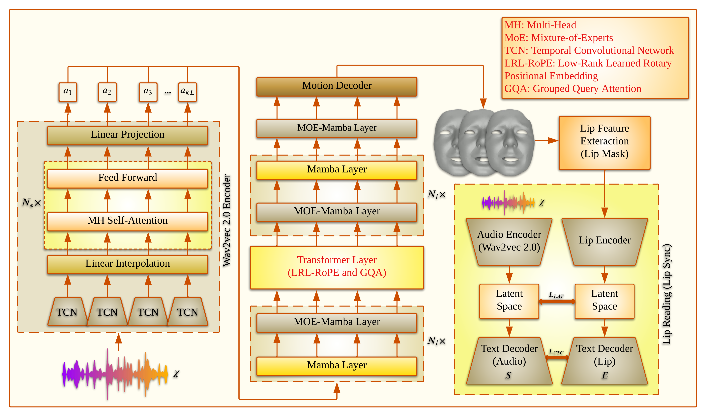

# JambaTalk: Speech-driven 3D Talking Head Generation based on a Hybrid Transformer-Mamba Model
Farzaneh Jafari, Stefano Berretti, Anup Basu

[[Paper]](https://arxiv.org/pdf/2408.01627)|[[Project Page]](https://farzanehjafari1987.github.io/JambaTalk.github.io/)|[[License]](https://github.com/FarzanehJafari1987/JambaTalk/blob/main/LICENSE)


The Wav2Vec 2.0 model is used to extract features from the input speech,
with the encoder initialized using pre-trained weights from the original model [5]. These encoded features are
passed to the JambaTalk decoder, which generates a sequence of animated 3D face meshes. The Transformer
layer incorporates Low-Rank Learned Rotary Positional Embedding (LRL-RoPE) and Grouped-Query Attention
(GQA), providing a computation-efficient alternative to traditional Transformers. The lip feature extraction
block then converts motion decoder outputs into lip deformation features by selecting lip vertices with a lip
mask, which are processed by a Transformer-based lip encoder in the lip reader module to synchronize lip
shapes.

---

## **Citation**
If you use JambaTalk in research, please cite:

```
@misc{jambatalk2024Jafari,
  title={JambaTalk: Speech-driven 3D Talking Head Generation based on a Hybrid Transformer-Mamba Model},
  author={Farzaneh Jafari, Stefano Berretti, Anup Basu},
  year={2024},
  note={arXiv preprint arXiv:2408.01627}
}
```
## **Acknowledgements**
This project builds on ideas and resources from:
- [FaceFormer](https://github.com/EvelynFan/FaceFormer)
- [CodeTalker](https://github.com/Doubiiu/CodeTalker)
- [FaceDiffuser](https://github.com/uuembodiedsocialai/FaceDiffuser)
- [SelfTalk](https://github.com/psyai-net/SelfTalk_release/tree/main)
- [FaceXHuBERT](https://github.com/galib360/FaceXHuBERT)
- [VOCASET](https://voca.is.tue.mpg.de/)
- [BIWI](https://github.com/Doubiiu/CodeTalker/blob/main/BIWI/README.md)
- [MPI-IS/mesh](https://github.com/MPI-IS/mesh)
- [Mamba](https://github.com/state-spaces/mamba)
- [Jamba](https://github.com/kyegomez/Jamba)
