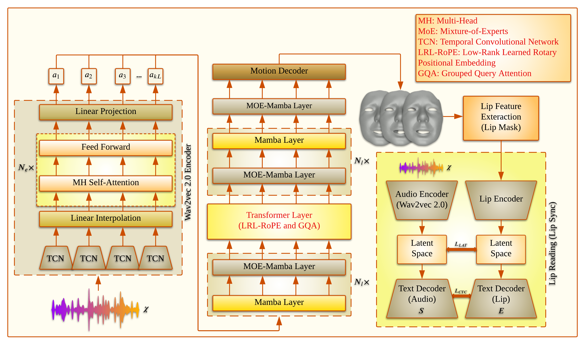

# JambaTalk


# JambaTalk: Talking Face Generation Framework

Official PyTorch implementation for **JambaTalk**, a framework for generating realistic 3D talking faces.

---

## **Citation**
If you use JambaTalk in research, please cite:

```
@misc{jambatalk2025Jafari,
  title={JambaTalk: Speech-driven 3D Talking Head Generation based on a Hybrid Transformer-Mamba Model},
  author={Farzaneh Jafari; Stefano Berretti; Anup Basu},
  year={2025},
  note={}
}
```

## **Acknowledgements**
This project builds on ideas and resources from:
- [FaceFormer](https://github.com/EvelynFan/FaceFormer)
- [CodeTalker](https://github.com/Doubiiu/CodeTalker)
- [FaceDiffuser]()
- [SelfTalk]()
- [FaceXHuBERT](https://github.com/galib360/FaceXHuBERT)
- [VOCASET](https://voca.is.tue.mpg.de/)
- [BIWI]()
- [MPI-IS/mesh](https://github.com/MPI-IS/mesh)
